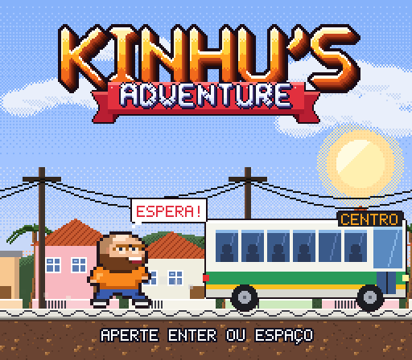
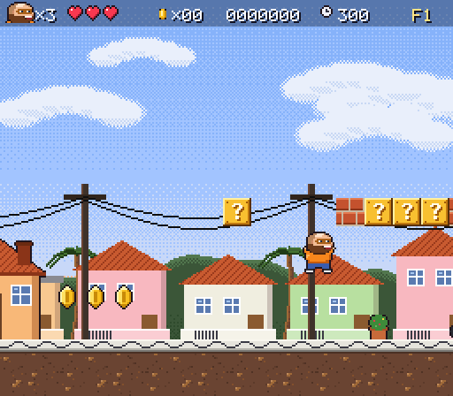
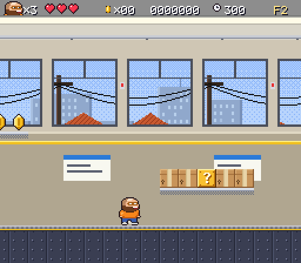
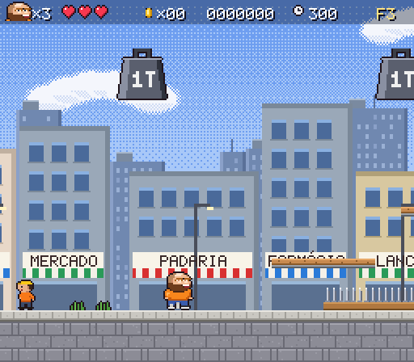
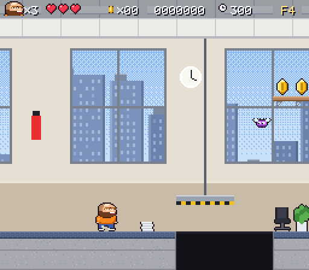

# Kinhu's Adventure

Jogo de plataforma em pixel art no estilo Super Nintendo, feito com HTML, CSS e JavaScript puros: sem frameworks, sem build e sem dependências. Roda direto no navegador e pode ser publicado de graça no **GitHub Pages**.



Segunda-feira, 07:42. O despertador não tocou e o Kinhu está atrasado. Ajude o Kinhu a pegar o ônibus, atravessar o centro da cidade e sobreviver a um dia de escritório, até enfrentar o **MEGA BUG** na sala dos servidores.

| | |
|---|---|
|  |  |
|  |  |

## Fases

1. **Saindo de Casa** (07:42): calçada de pedra portuguesa, cachorros caramelo, pombos, baratas, muro com caco de vidro, córrego e uma rua com carros. Termina no ponto de ônibus, e o ônibus chega para buscar o Kinhu.
2. **Viagem de Ônibus** (07:55): dentro do ônibus lotado. Bancos, bagageiros, passageira com bolsa, trombadinha que rouba moedas e as **freadas**, **arrancadas** e **lombadas**, que empurram todo mundo.
3. **Centro da Cidade** (08:20): bueiros abertos, hidrante que espirra água, obra com peso de 1 tonelada caindo, tábuas que despencam, avenida movimentada e skatistas.
4. **O Escritório** (09:00): mesas, arquivos, impressoras que atiram papel, colegas estressados jogando aviãozinho, estagiário correndo com café, chão molhado, tachinhas, elevadores e bugs.
5. **Sala dos Servidores** (16:59): faíscas, água eletrificada e a luta contra o **MEGA BUG**.

## Controles

| Ação | Teclado | Controle (gamepad) | Celular |
|---|---|---|---|
| Andar | Setas ou A / D | Direcional / analógico | ◀ ▶ |
| Pular (segure para ir mais alto) | Z, Espaço, ↑ ou W | A | A |
| Correr | X ou Shift | B / X | B |
| Arremessar grãos (com café) | X | B / X | B |
| Descer de plataforma | ↓ + pular | ↓ + A | ▼ + A |
| Pausa / menu | Enter ou Esc | Start | START |
| Som | M | | |
| Tela cheia | F | | |

## Itens

- **Moeda**: 100 moedas dão uma vida extra.
- **Cachorro-quente**: recupera um coração.
- **Café**: o Kinhu fica de camiseta vermelha e pode arremessar grãos de café (tecla X). Se levar dano, perde só o café.
- **Garras**: ativa o **modo Kinhurine**. O cabelo arrepia e o Kinhu fica invencível por alguns segundos.
- **Crachá 1UP**: vida extra.
- **Relógio de ponto**: é o checkpoint ("bateu o ponto!"). Se morrer, você volta dali.

## Salvamento

- **Automático (cache do navegador)**: o jogo salva sozinho no `localStorage` ao começar cada fase, ao bater o ponto e ao terminar uma fase. Na tela inicial aparece **CONTINUAR**.
- **Arquivo de save (.json)**: na pausa (ou na tela inicial, ou pelos botões abaixo da tela) use **BAIXAR ARQUIVO DE SAVE**. É baixado um arquivo como `kinhus-adventure-save-20261007-0915.json`.
- **Carregar em outro lugar**: em outro computador ou navegador, use **CARREGAR ARQUIVO DE SAVE** e escolha o arquivo, ou simplesmente **arraste o arquivo para a página**. O jogo continua de onde você parou.
- O arquivo tem uma soma de verificação: se for corrompido ou editado à mão, o jogo recusa e avisa.

## Publicar no GitHub Pages (grátis)

O projeto já está pronto como repositório Git local (branch `main`). Para publicar:

1. Entre em [github.com/new](https://github.com/new) e crie um repositório **público** chamado `kinhus-adventure`, sem README, sem .gitignore e sem licença.
2. Nesta pasta, rode (troque `SEU-USUARIO` pelo seu usuário do GitHub):

   ```bash
   git remote add origin https://github.com/SEU-USUARIO/kinhus-adventure.git
   ```

   ```bash
   git push -u origin main
   ```

3. No GitHub, abra **Settings → Pages**. Em **Build and deployment**, escolha **Source: Deploy from a branch**, branch **main**, pasta **/ (root)** e clique em **Save**.
4. Depois de um ou dois minutos o jogo estará em:

   `https://SEU-USUARIO.github.io/kinhus-adventure/`

Sem usar Git: crie o repositório, clique em **Add file → Upload files**, arraste todo o conteúdo desta pasta (menos `.git`) e siga a partir do passo 3.

## Jogar localmente

Dá para abrir o `index.html` direto no navegador (duplo clique).

Também existe a versão em **arquivo único**: `dist/kinhus-adventure.html` (cerca de 210 KB, com tudo embutido). Dá para mandar esse arquivo por e-mail ou WhatsApp e abrir em qualquer navegador, mesmo sem internet. Depois de mudar o código, gere de novo com:

```bash
node tools/bundle.js
```

Se preferir um servidor local:

```bash
python -m http.server 8765
```

Depois acesse `http://localhost:8765`.

## Estrutura

```
index.html          página do jogo (canvas 256×224, escalado em pixels inteiros)
css/style.css       moldura, barra de opções e controles de toque
js/core.js          tela, entrada (teclado/controle/toque), fonte bitmap, ferramentas de pixel art
js/sprites.js       Kinhu, inimigos, itens e projéteis (pixel art desenhada em código)
js/world.js         temas, blocos, fundos com parallax, decoração, carros, ônibus, prédios
js/audio.js         sintetizador chiptune com eco estilo SNES, músicas e efeitos
js/levels.js        mapas das 5 fases (texto: cada caractere é um bloco de 16×16)
js/save.js          salvamento no navegador e arquivo de save .json
js/game.js          física, Kinhu, inimigos, itens, chefe, chegada nas fases
js/main.js          telas, menus, HUD, transições e laço principal (60 fps fixos)
assets/title.png    arte do título (logo original do Kinhu's Adventure)
tools/              ferramentas de desenvolvimento em Node (não são necessárias para jogar)
```

### Editando fases

Cada fase em `js/levels.js` é uma lista de segmentos com 14 linhas cada. A legenda completa está no topo do arquivo: `#` chão, `?` bloco de moeda, `c` moeda, `d` cachorro, `C` relógio de ponto, `G` chegada e assim por diante.

### Ferramentas (opcional, precisa de Node.js)

```bash
node tools/bot.js all
```

O robô de teste tenta zerar cada fase segurando "direita" e pulando obstáculos; use `inv` para ignorar dano.

```bash
node tools/test.js tools/out
```

Gera prints de todas as fases sem abrir o navegador. `tools/sheet.js`, `tools/scenes.js` e `tools/make-assets.js` geram folhas de sprites, cenas especiais, o ícone e os prints deste README.

## Créditos

- Arte do título: logo original do Kinhu's Adventure.
- Personagem inspirado no Kinhu de verdade: careca, barba, óculos e camiseta laranja.
- Código, pixel art do jogo, músicas e efeitos sonoros: gerados para este projeto, sem nenhum arquivo de terceiros.
